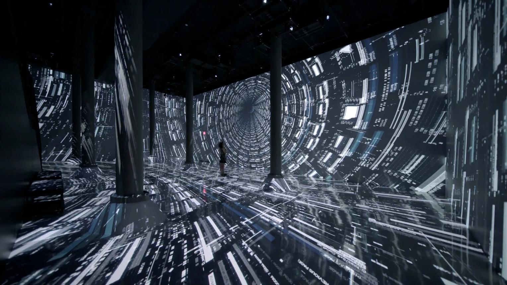
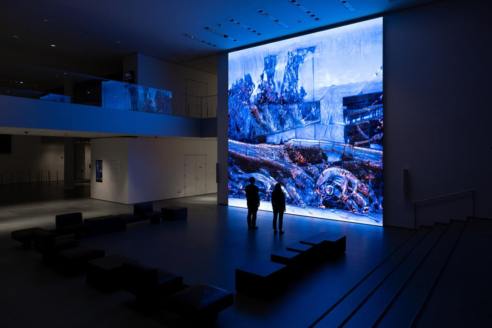

# Week 8 Quiz
## Part 1: Imaging Technique Inspiration

My inspiration is Refik Anadol’s *Unsupervised — Machine Hallucinations* at MoMA. The aspect I want to incorporate is its flowing, dream-like movement, where image data becomes soft waves, particles, and abstract colour fields. This technique would be useful for my project because it can turn ordinary visual material into an immersive atmosphere rather than a literal image. Even if I cannot fully recreate AI data painting, I can use its visual language—motion, distortion, layering, and colour blending—to make my assignment feel more experimental and emotionally engaging.  

Source: [Refik Anadol Studio](https://refikanadol.com/works/machine-hallucination/)  

---

## Part 2: Coding Technique Exploration

### Coding technique: Pixel sorting in p5.js

Pixel sorting could help me create a similar distorted and fluid visual effect without needing advanced AI tools. This technique rearranges pixels according to brightness, colour, or position, creating stretched, melted, or glitch-like forms. It would support my imaging inspiration because it transforms a normal image into something more abstract and atmospheric. In p5.js, pixel sorting can also be interactive, allowing the viewer’s mouse movement or keyboard input to change the level of distortion in real time.

Example tutorial and code: [Happy Coding — Pixel Sorter](https://happycoding.io/tutorials/p5js/images/pixel-sorter)  
Example implementation: [OpenProcessing — Pixel Sorting](https://openprocessing.org/sketch/1924903)